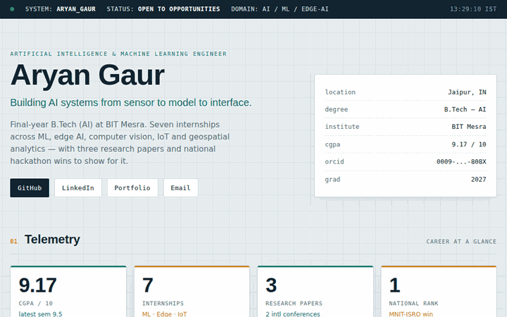

<!-- ===== Animated wave header ===== -->

  

<!-- ===== Animated typing subtitle ===== -->

  

<!-- ===== Link badges ===== -->

  
  
  
  

<!-- ===== Animated dashboard preview (clicks through to live site) ===== -->

  
   
  <i>▲ Live interactive dashboard — click to open</i>

---

### About

Final-year **B.Tech (Artificial Intelligence)** student at **BIT Mesra** (CGPA 9.17). Seven internships spanning machine learning, edge AI, computer vision, IoT and geospatial analytics — with **3 research papers** across two international conferences and national hackathon wins.

- 🔬 Author of 3 papers presented at **ICIEM'26** and **IDBA'26**
- 🏆 **1st Rank** — MNIT-ISRO National Hackathon · **AIR 4** — National IDEATHON-25 · **AIR 3** — AMD Slingshot
- 🌱 Currently deepening work in **Edge AI**, **RAG / Small Language Models**, and **embedded ML**
- 📫 Reach me at **aryangaur76731@gmail.com**

---

### Featured Projects

| Project | What it does | Stack |
|---|---|---|
| **[SAURNET](https://github.com/Aryangaur-code/saurnet)** | Edge-AI solar monitoring — real-time fault detection, anomaly analysis &amp; power forecasting. Basis of the ICIEM'26 paper. | `CNN` `LSTM` `TF Lite` `MQTT` |
| **EDU-RESQ** | RFID/GPS smart-card system with geofencing, live tracking, attendance &amp; emergency response. | `LSTM` `SVM` `SQL` |
| **SUDARSHANA** | Wearable safety device with sensor fusion that detects distress and triggers SOS alerts. | `Random Forest` `RNN` `PyTorch` |
| **GOV-ASSIST AI** | Conversational governance assistant for scheme discovery, eligibility &amp; grievance redressal. | `RAG` `XGBoost` `scikit-learn` |
| **ARTH-NITI** | Economic-intelligence platform combining ML, knowledge graphs &amp; geospatial analytics. | `KNN` `XGBoost` |

---

### Tech Stack

**Focus areas:** Deep Learning (CNN · LSTM · RNN) · Edge AI / TinyML · Computer Vision · RAG &amp; SLMs · IoT &amp; Embedded Systems · Knowledge Graphs · Geospatial Analytics

---

### GitHub Stats

  
  

  

<!-- ===== Animated contribution snake (needs the GitHub Action below) ===== -->

  

<!-- ===== Animated wave footer ===== -->

  

